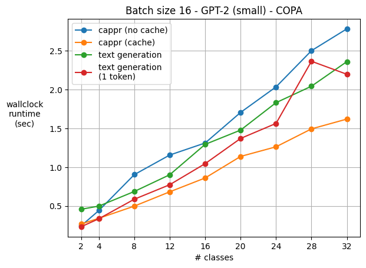

Computational performance
=========================

One concern is that CAPPr requires as many model calls as there are choices/classes. But
in the CAPPr scheme, we can cache each attention block's keys and values for the
prompts. This feature is already supported by ``AutoModelForCausalLM``\ s. See `this
module <https://github.com/kddubey/cappr/blob/main/src/cappr/huggingface/classify.py>`_
for the implementation. Here's a somewhat cherry-picked experiment:

   `COPA`_ dataset, repeating the choices to simulate multi-class classification tasks.
   `GPT-2 (small)`_ was run on a T4 GPU. 48 classification inputs were processed in
   batches of size 16. For a controlled runtime comparison, GPU RAM was held (roughly)
   constant for each method and each number of classes. Each point in the graph is a
   median of 5 runs. For text generation, exactly 4 tokens were generated for each
   prompt, which is the number of tokens in ``'\n\nAnswer A'``. 1-token times are also
   shown. But for COPA (and other multiple-choice style prompts), that may result in
   lower zero-shot accuracy, as most of the sampled choices come after the first token.

.. _COPA: https://people.ict.usc.edu/~gordon/copa.html

.. _GPT-2 (small): https://huggingface.co/gpt2

See `this notebook
<https://github.com/kddubey/cappr/blob/main/demos/computational_analysis.ipynb>`_ for
the code which produced the figure above.

.. note:: For :mod:`cappr.llama_cpp.classify`, batch inference currently isn't possible.
          As a result, text generation is typically faster than CAPPr when there are
          many completions.

Weaknesses
----------

CAPPr does not computationally perform well when there are 10s of classes and the prompt
is so long that only one or two fit in memory during processing. For a demonstration of
this weakness, see the `Banking 77 demo
<https://github.com/kddubey/cappr/blob/main/demos/huggingface/banking_77_classes.ipynb>`_.

This weakness isn't apparent in the COPA demo above because CAPPr's prompt can be short
without sacrificing accuracy. Are there more classification tasks where classes don't
need to be provided in context (and instead provided as a completion) for CAPPr to
statistically perform well? If so, CAPPr's computational issues can be worked around
through better prompt engineering. And the model's context window can be reduced. Based
on a few experiments, it seems like the answer to this question is no; mentioning
choices in the prompt improves accuracy.

From an engineering standpoint, another weakness of CAPPr is that computational
optimizations require the ability to control the cache and batch inputs. The model must
implement the HuggingFace transformers interface—including accepting and returning
``past_key_values``. With sampling, caching is simpler, and batching isn't required.
