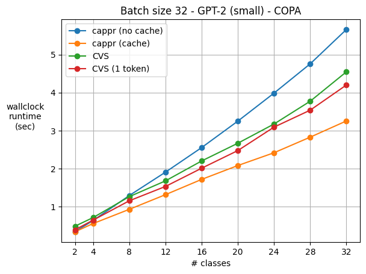

Computational performance
=========================

One concern was that CAPPr requires as many model calls as there are classes. But in the
CAPPr scheme, we can simply cache each attention block's keys and values for the
prompts. This feature is already supported by ``AutoModelForCausalLM``\ s. See `this
module`_ for the implementation. Note that this caching is not implemented for OpenAI
models, as I can't control their backend. So if you're running
:mod:`cappr.openai.classify` functions, you'll be on the *cappr (no cache)* line :-(

.. _this module: https://github.com/kddubey/cappr/blob/main/src/cappr/huggingface/classify.py

   `COPA`_ dataset, repeating the choices to simulate multi-class classification tasks.
   `GPT-2 (small)`_ was run on a T4 GPU. 96 classification inputs were processed in
   batches of size 32. For a controlled runtime comparison, GPU RAM was held (roughly)
   constant for each method and each number of classes. Each point in the graph is a
   median of 5 runs. For text generation, exactly 4 tokens were generated for each
   prompt, which is the number of tokens in ``'\n\nAnswer A'``. 1-token times are also
   shown. But for COPA (and other multiple-choice style prompts), that may result in
   lower zero-shot accuracy, as most of the sampled choices come after the first token.

.. _COPA: https://people.ict.usc.edu/~gordon/copa.html

.. _GPT-2 (small): https://huggingface.co/gpt2

See `this notebook
<https://github.com/kddubey/cappr/blob/main/demos/computational_analysis.ipynb>`_ for
the code which produced the figure above.

.. note:: For :mod:`cappr.llama_cpp.classify`, batch inference currently isn't possible.
          As a result, memory is saved at the cost of greater runtime compared to text
          generation.

Future experiments
------------------

:mod:`cappr.huggingface.classify` and :mod:`cappr.huggingface.classify_no_cache`
currently process completions in parallel.  Memory savings can be achieved by using
:mod:`cappr.huggingface.classify_no_batch`, which processes each prompt-completion pair
one at a time. This should result in memory savings over text generation because a CAPPr
prompt is typically smaller than a text generation prompt. A text generation prompt must
describe each class in the prompt, and the model must attend to all of this information
to perform well. A CAPPr prompt sometimes doesn't need to include info about the classes
to perform well. A completion is only one of the classes. As a result, model context and
memory requirements can be relaxed. I'll need to run experiments to demonstrate the
extent to which this is true.
