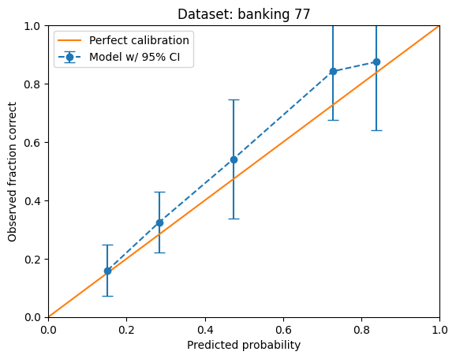

Statistical performance
=======================

Modern language models undergo at least two training stages: pretraining, and
instruction training. When solving a classification task, it's tempting to lean on
instruction-style prompts in combination with text generation. This combination works
incredibly well for multi-GPU, proprietary models. But what about smaller, open source
ones? Perhaps there are smaller or undertrained models which are not good at generating
a choice, but are good at estimating probabilities.

A handful of experiments suggests that CAPPr squeezes more out of smaller LLMs for text
classification tasks. In the `OpenAI COPA demo
<https://github.com/kddubey/cappr/blob/main/demos/openai/superglue/copa.ipynb>`_, text
generation using OpenAI's smaller model, ``text-curie-001``, is less than 50% accurate.
CAPPr using the same model is 80% accurate. Similar but less wild results can be seen
in:

- the 4-bit 4 GB Llama 2 `COPA demo`_
- the 4-bit 4 GB Llama 2 `AG News demo
  <https://github.com/kddubey/cappr/blob/main/demos/llama_cpp/ag_news.ipynb>`_
- the 4 GB Mistral `Craigslist Bargains demo`_
- the 4 GB Mistral `Banking 77 demo`_ (with 77 multi-token choices)
- the 4 GB Mistral `Tweet Emotion demo
  <https://github.com/kddubey/cappr/blob/main/demos/huggingface/tweet_emotion_multilabel.ipynb>`_
  (a multilabel problem).

.. raw:: html
   :file: _static/spider_plot.html

.. .. raw:: html

..    <iframe src="http://127.0.0.1:8050" width="700" height="500"></iframe>

I'll study how replicable this result is across classification tasks, model sizes, and
levels of quantization. I'll also study explanations for these results. The working
hypothesis is two-fold:

- CAPPr-style `prompt-completion formats
  <https://cappr.readthedocs.io/en/latest/select_a_prompt_completion_format.html>`_ can
  look more like pretraining data, which is typically where a lot of learning happens.
  This is demonstrated in the `COPA demo`_
- Despite strict instructions not to, models can generate "I don't know", or make a
  choice that's difficult to map to the given list of choices. CAPPr instead has the
  model make its "best" guess among the given choices. This is demonstrated in the
  `Banking 77 demo`_.

Calibration
-----------

The `calibration
<https://en.wikipedia.org/wiki/Probabilistic_classification#Probability_calibration>`_
of CAPPr estimates has barely been studied. These estimates are slightly different than
usual next-token log probability estimates because:

- CAPPr hackily takes a mean over next-token log probabilities
- CAPPr can incorporate a prior specific to your classification data.

The `Banking 77 demo`_ contains two low-resolution but interesting calibration curves.
Here's the nice-looking curve:

.. _COPA demo: https://github.com/kddubey/cappr/blob/main/demos/llama_cpp/superglue/copa.ipynb

.. _Craigslist Bargains demo: https://github.com/kddubey/cappr/blob/main/demos/huggingface/craigslist_bargains.ipynb

.. _Banking 77 demo: https://github.com/kddubey/cappr/blob/main/demos/huggingface/banking_77_classes.ipynb
